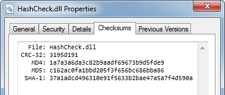
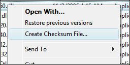

# HashCheck Shell Extension

_A simple hashcheck shell extension from [code.kliu.org](https://code.kliu.org)._

## Overview

The HashCheck Shell Extension makes it easy for anyone to calculate and verify checksums and [hashes](https://en.wikipedia.org/wiki/Cryptographic_hash_function) from Windows Explorer. In addition to integrating file checksumming functionality into Windows, HashCheck can also create and verify [SFV files](https://en.wikipedia.org/wiki/Simple_file_verification) (and other forms of checksum files, such as .md5 files). It is fast and efficient, with a very light disk and memory footprint, and it is open-source.

Release              |  Info
---------------------|--------------------------
**Current version:** | [2.1.11](changelog.html)
**Released on:**     | [1 Jul 2009](changelog.html)
**Requirements:**    | Windows XP (or newer)

 

## Features

### Checksum Hash Verification

HashCheck can process and verify the checksums/hashes stored in checksum files—these are files with a .sfv, .md4, .md5, or .sha1 file extension. Just double-click on the checksum file, and HashCheck will check the actual checksums of the listed files against those specified in the checksum file.

### Shell Integration: Checksums at Your Fingertips

HashCheck will add a "Checksums" tab to the shell's file properties dialog so that you could easily check the hash of a file (or even multiple files and directories) from Windows Explorer. You can also save the results to a checksum file.

### Create checksum files

If you want to create a checksum file but think that opening the file properties dialog, navigating to the "Checksums" tab and then clicking "Save" is too much trouble, HashCheck simplifies the task by adding an optional "Create Checksum File" command to the shell's context menu. Simply select the files and directories that you want to hash and create a checksum file for, right-click on them, and select "Create Checksum File".

### Lean and mean

The HashCheck Shell Extension has a very small memory and disk footprint (the 32-bit version consumes less than 100 KiB of disk space). It is also very fast and responsive; it can, for example, load and parse a SFV file with a million entries in just a fraction of a second.

### Free and open-source

The HashCheck Shell Extension is open-source, licensed under a [BSD-style license](license.txt), so that anyone with some knowledge of C can easily build their own customized version of this shell extension.

### Compatibility: international support and 64-bit-compatible

The user interface text has been translated into [many languages](#translations), so that it will blend in seamlessly with most systems. Additionally, this shell extension is natively Unicode and can thus support a wide range of file and directory names.

Both x86-32 and x86-64 systems are natively supported, so you can use this with the increasingly common 64-bit versions of Windows.

## Contributing

### Translations

Supported languages  | Translator(s)
---------------------|-------------------------
English              | NA
中文 (简体)           | "yumeyao"
中文 (繁體)           | Jack Chang
čeština              | Václav Veselý
Deutsch              | "Rolf"
Ελληνικά             | "XhmikosR"
español              | "Phare"
français             | "mooms" and "user\_hidden"
italiano             | "Botta"
日本語                | "yumeyao"
한국어                | JaeHyung Lee
Nederlands           | "Edwin"
polski               | "RedWine"
Português (Brasil)   | "0d14r3"
português (Portugal) | "LPCA"
română               | Oprea Nicolae, a.k.a. "Jaff"
русский              | Yurii Petrashko
svenska              | Stefan Friman
Türkçe               | M. Ömer Gölgeli
українська           | Yurii Petrashko

### How you can help

If you would like to contribute a translation, please translate and submit [this file](translations.txt). If you would like to suggest a correction to an existing translation, please [file a bug](/tracker/).

**More info:** [FAQ](faq.html) | [Changelog](changelog.html) | [Screenshots](images/)
